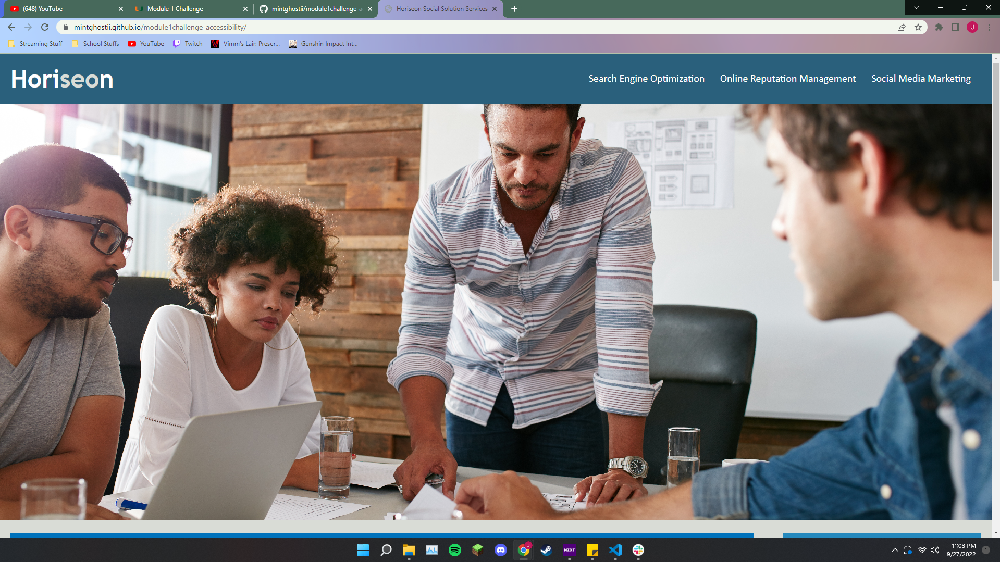

# UM Coding Bootcamp Module 1 Challenge

## Editing the code to ensure that it follows accessibility standards.

## User Story

```
AS A marketing agency
I WANT a codebase that follows accessibility standards
SO THAT our own site is optimized for search engines
```

## Acceptance Criteria

```
GIVEN a webpage meets accessibility standards
WHEN I view the source code
THEN I find semantic HTML elements
WHEN I view the structure of the HTML elements
THEN I find that the elements follow a logical structure independent of styling and positioning
WHEN I view the image elements
THEN I find accessible alt attributes
WHEN I view the heading attributes
THEN they fall in sequential order
WHEN I view the title element
THEN I find a concise, descriptive title
```

## Changes made to the webpage

- added a more descriptive title
- added semantic tags
- added alt text to images and icons
- added comments to HTML for readability
- fixed missing id to make the nevigation bar work correctly
- changed footer h2 tag to h3 to fix hierarchy

## Screenshot



## Deployed page

Page published at:https://mintghostii.github.io/module1challenge-accessibility/